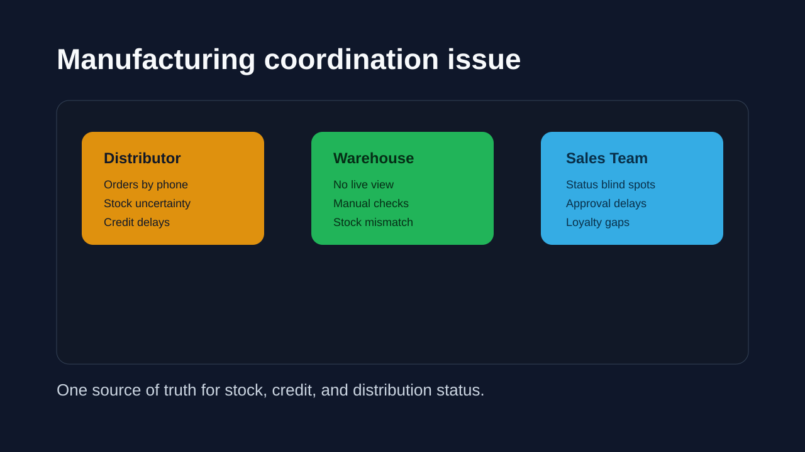
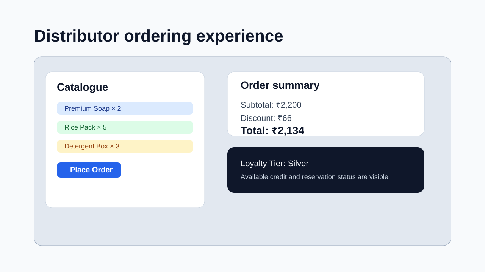
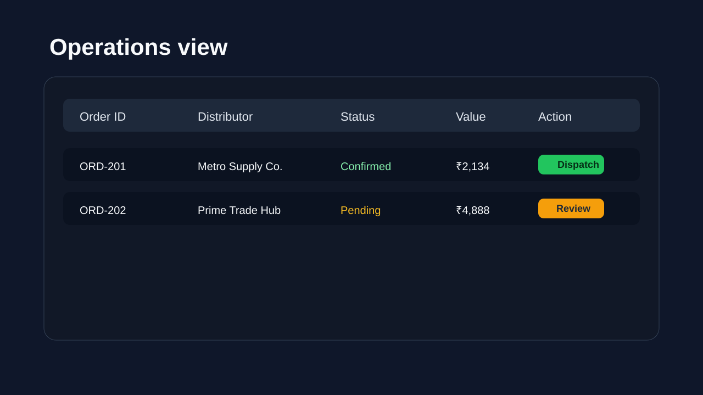
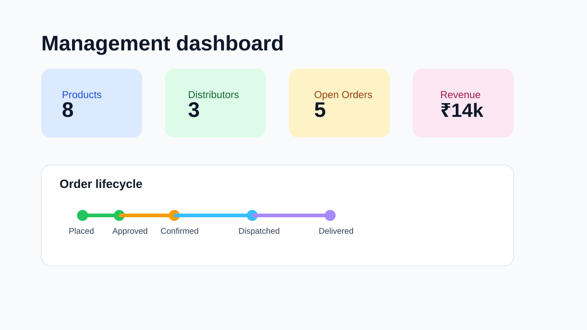
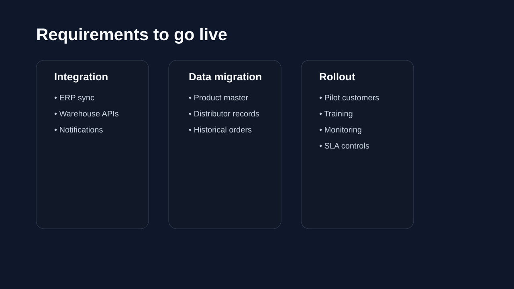
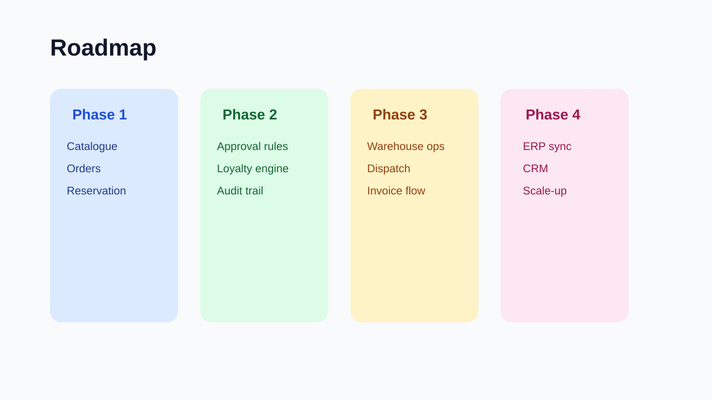

# Metayb Pitch Deck

## Slide 1 — The problem

Manufacturers often struggle to coordinate distributor orders with warehouse availability and loyalty programmes. Distributors place orders through fragmented channels, while sales teams and warehouses have limited visibility into which orders are approved, dispatched, or pending credit review.

## Slide 2 — The sales experience

Distributors can browse the catalogue, select products, and place orders with a clear subtotal, discount, and total. The system shows the current loyalty tier and account status before confirming the purchase, making ordering simpler and more transparent.

## Slide 3 — The operational view

Warehouse and sales teams can review all orders in a single workflow. Each order shows status, line items, discount impact, and current allocation status, helping teams act faster without manual reconciliation.

## Slide 4 — The dashboard view

Managers see summary KPIs such as total products, open orders, distributor count, and revenue. This creates a live view of business health and highlights where stock or credit constraints need attention.

## Slide 5 — Requirements to go live

Before production launch, the system needs: database migration and validation, secure API deployment, integration with warehouse updates, and audit safety for order lifecycle transitions. Distributor and product data must be migrated from legacy systems with validation checks and rollback coverage.

## Slide 6 — Roadmap

Phase 1: live order placement and stock reservation
Phase 2: approval logic, loyalty automation, and audit trails
Phase 3: warehouse dispatch, invoice matching, and reporting
Phase 4: ERP, CRM, and notification integrations for scale-up

